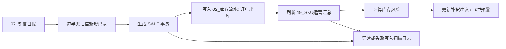

# 销售日报库存自动扣减与预警设计

日期：2026-06-04

## 1. 背景

当前库存流转模块已经把采购入库、头程流转、异常暂存和 SKU 运营汇总串起来：

- `02_库存流水` 是不可覆盖的库存事件账本。
- `18_SKU库存策略` 保存安全库存、补货周期等策略参数。
- `19_SKU运营汇总` 保存本地库存、国内集货仓、橙联在途、橙联可售、总可用库存、近 7 日日均销量等运营快照。
- `23_库存异常` 用于承接数量差异、报损和人工核查。
- `24_库存流转事务` 用于保存库存操作幂等事务。

目前销售日报录入后已经会刷新累计销量和近 7 日日均销量，但销售事实还没有自动转化为“订单出库”库存流水，也没有形成低库存预警闭环。为了先绕开 eBay API 权限和订单状态复杂度，一期采用扫描 `07_销售日报` 的方式做自动扣减。

## 2. 目标

1. 每半天扫描一次 `07_销售日报` 中尚未处理的销售记录。
2. 对每条销售记录生成幂等事务，避免重复扣库存。
3. 自动写入 `02_库存流水` 的 `订单出库` 记录，扣减 `橙联可售`。
4. 刷新 `19_SKU运营汇总` 的橙联可售、总可用库存、累计销量、近 7 日日均销量和快照日期。
5. 根据销售速度和库存策略识别低库存 SKU，并更新补货建议或发送飞书预警。
6. 库存不足、SKU 缺失、字段异常等情况进入异常记录或扫描日志，方便人工处理。

## 3. 非目标

1. 一期不接 eBay 订单 API，不处理平台实时 webhook。
2. 一期不区分店铺级库存扣减，默认所有销售从 `橙联可售` 扣减。
3. 一期不自动创建采购批次，只生成或更新补货建议。
4. 一期不让销售扣减直接把 `橙联可售` 扣成负数；库存不足时进入异常处理。

## 4. 自动化流程



## 5. 扫描触发

### 5.1 定时触发

系统每天执行两次扫描，暂定为：

- 上午批次：09:00
- 下午批次：17:00

这两个时间点覆盖半天级库存变化，适合当前销售日报模式，也能避免过于频繁地读写多维表格。

### 5.2 手动触发

后台保留一个手动扫描 API，用于临时补扫和排查：

- `POST /api/inventory/sales-scan`

手动扫描和定时扫描共用同一套幂等逻辑，所以重复触发不会重复扣库存。

## 6. 数据口径

### 6.1 销售日报输入字段

扫描 `07_销售日报` 时至少需要以下字段：

| 字段 | 用途 |
| --- | --- |
| `SKU` | 匹配 `19_SKU运营汇总` 和库存策略 |
| `日期` | 计算近 7 日日均销量 |
| `售出数量` | 扣减库存和累计销量 |
| `店铺` | 后续扩展店铺库存时使用，一期只记录上下文 |
| `销售额` | 补货优先级扩展参考，一期不参与扣减 |

如果销售日报没有稳定订单号，一期使用销售日报记录 ID 作为幂等来源。

### 6.2 幂等事务号

每条销售日报记录生成一个事务号：

```text
SALE-${销售日报记录ID}-${SKU}
```

事务写入 `24_库存流转事务`：

| 字段 | 值 |
| --- | --- |
| `事务号` | `SALE-${recordId}-${SKU}` |
| `请求摘要` | 销售日报记录 ID、SKU、售出数量、销售日期 |
| `事务状态` | `pending` 或 `completed` |
| `操作类型` | `订单出库` |
| `失败原因` | 处理失败时记录 |

系统发现事务已完成时跳过，发现事务 pending 时允许重试。

### 6.3 库存流水

成功扣库存时写入 `02_库存流水`：

| 字段 | 值 |
| --- | --- |
| `SKU` | 销售日报 SKU |
| `日期` | 销售日报日期 |
| `变动类型` | `订单出库` |
| `库存位置` | `橙联可售` |
| `数量变动` | `-售出数量` |
| `相关单号` | 销售日报记录 ID 或事务号 |
| `操作人` | `系统自动扫描` |
| `备注` | `销售日报自动扣减` |
| `流转事务号` | `SALE-${recordId}-${SKU}` |

### 6.4 汇总刷新

每条成功库存流水落库后刷新对应 SKU 的 `19_SKU运营汇总`：

- `橙联可售 = 橙联可售 - 售出数量`
- `总可用库存 = 本地库存 + 国内集货仓 + 橙联在途 + 橙联可售`
- `账面总量 = 总可用库存 + 异常暂存`
- `累计销量` 和 `近7日日均销量` 从完整销售日报重新计算
- `快照日期 = 当前时间`

### 6.5 库存不足

如果扣减后 `橙联可售 < 0`：

1. 不写入负数汇总。
2. 不把事务标记为 completed。
3. 写入 `23_库存异常`，类型为 `销售扣减库存不足`。
4. 扫描日志记录失败原因。
5. 飞书预警中标记为需要人工核查。

## 7. 预警口径

扫描完成后，对本次影响到的 SKU 计算库存风险。

| 等级 | 条件 |
| --- | --- |
| 紧急 | `近7日日均销量 > 0` 且 `橙联可售 / 近7日日均销量 < 7` |
| 需采购 | `近7日日均销量 > 0` 且 `橙联可售 / 近7日日均销量 < 补货周期天数` |
| 低库存 | `总可用库存 <= 安全库存` |
| 异常 | SKU 缺失、库存不足、销售数量非法、汇总缺失 |

同一个 SKU 命中多个条件时，优先级为：

```text
异常 > 紧急 > 需采购 > 低库存
```

## 8. 多维表格协作

### 8.1 复用现有表

- `07_销售日报`：销售事实来源。
- `02_库存流水`：保存订单出库流水。
- `19_SKU运营汇总`：保存库存快照和销售速度。
- `18_SKU库存策略`：提供安全库存和补货周期。
- `23_库存异常`：保存销售扣减异常。
- `24_库存流转事务`：保存幂等事务。
- `10_补货采购建议`：保存补货建议。

### 8.2 建议新增表

新增 `25_库存预警日志`，用于记录每次扫描结果和预警处理状态。

建议字段：

| 字段 | 类型 | 说明 |
| --- | --- | --- |
| `预警编号` | 文本 | `WARN-${日期}-${SKU}` |
| `扫描批次号` | 文本 | 一次扫描的批次 ID |
| `SKU` | 文本 | 预警 SKU |
| `预警等级` | 单选 | 异常、紧急、需采购、低库存 |
| `橙联可售` | 数字 | 扫描后的橙联可售 |
| `总可用库存` | 数字 | 扫描后的总可用库存 |
| `近7日日均销量` | 数字 | 销售速度 |
| `预计可售天数` | 数字 | `橙联可售 / 近7日日均销量` |
| `建议采购量` | 数字 | 根据补货周期和缓冲天数计算 |
| `处理状态` | 单选 | 待处理、已通知、已转采购、已关闭 |
| `失败原因` | 长文本 | 异常项说明 |
| `创建时间` | 日期时间 | 预警生成时间 |
| `更新时间` | 日期时间 | 最近处理时间 |

建议视图：

- `紧急预警`
- `待处理预警`
- `已转采购`
- `异常核查`

## 9. 飞书通知

一期只推送高信号内容，避免刷屏。

推送条件：

1. 出现异常。
2. 出现紧急预警。
3. 本次扫描新增或升级了需采购预警。

消息格式：

```text
库存预警扫描完成
扫描批次：SCAN-20260604-0900
处理销售记录：36 条
成功扣减：34 条
异常：2 条
紧急 SKU：3 个

紧急列表：
- SKU-001 橙联可售 5，近7日日均 2.5，预计 2 天售罄
- SKU-002 橙联可售 8，近7日日均 1.8，预计 4.4 天售罄
```

## 10. 错误处理

| 场景 | 处理 |
| --- | --- |
| SKU 为空 | 跳过，写扫描日志 |
| 售出数量为空或小于等于 0 | 跳过，写扫描日志 |
| 汇总表找不到 SKU | 写异常日志，不扣库存 |
| 库存不足 | 创建库存异常，不扣成负数 |
| 库存流水写入成功但汇总失败 | 事务保持 pending，下次扫描重试汇总 |
| 飞书通知失败 | 不影响库存扣减，写入扫描日志 |

## 11. API 与模块边界

### 11.1 服务层

新增服务模块：

```text
src/lib/sales-inventory-scan.ts
```

职责：

- 读取销售日报、汇总、策略和事务。
- 生成扣库存计划。
- 写库存流水。
- 刷新 SKU 汇总。
- 计算预警。
- 写预警日志。

### 11.2 API

新增 API：

```text
POST /api/inventory/sales-scan
```

请求体：

```json
{
  "mode": "manual",
  "limit": 200
}
```

响应：

```json
{
  "success": true,
  "scanId": "SCAN-20260604-0900",
  "processed": 36,
  "deducted": 34,
  "skipped": 0,
  "exceptions": 2,
  "warnings": 3
}
```

### 11.3 定时任务

部署层配置每天两次调用：

```text
09:00 Asia/Shanghai
17:00 Asia/Shanghai
```

如果后续部署在 Cloudflare Workers，可用 Cron Trigger；本地开发和手动排查使用 API 触发。

## 12. 测试策略

### 12.1 单元测试

覆盖：

1. 根据销售日报记录生成幂等事务号。
2. 已完成事务不会重复扣库存。
3. pending 事务可重试。
4. 成功销售记录会生成 `订单出库` 库存流水。
5. 汇总刷新后 `橙联可售`、`总可用库存`、`账面总量` 正确。
6. 库存不足时生成异常，不写负库存。
7. 预警等级优先级正确。

### 12.2 API 测试

覆盖：

1. 非管理员不能手动触发扫描。
2. 请求参数非法时返回 400。
3. 正常扫描返回统计摘要。
4. 飞书写入失败时返回可排查错误。

### 12.3 集成验证

使用一条测试销售日报：

1. SKU 当前 `橙联可售 = 10`。
2. 销售日报 `售出数量 = 3`。
3. 手动触发扫描。
4. 验证 `02_库存流水` 新增 `-3` 订单出库。
5. 验证 `19_SKU运营汇总` 的 `橙联可售 = 7`。
6. 重复触发扫描，验证库存不会再次扣减。

## 13. 后续扩展

1. 接入 eBay 订单 API 后，把销售日报扫描改为兜底校准。
2. 增加订单取消、退款、退货入库的反向流水。
3. 按店铺维度扣减库存，替换当前默认扣 `橙联可售` 的一期口径。
4. 把预警日志与采购批次联动，支持一键创建采购计划。
